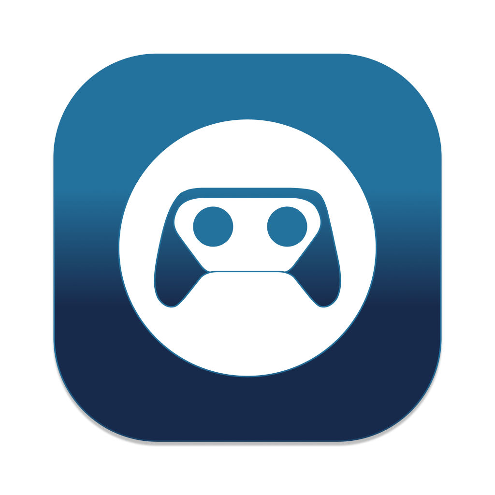

# Console Link

Console Link is a game capture card preview tool specifically designed for macOS. This tool supports not only video preview, but also audio preview. By utilizing the Metal GPU for graphic rendering, Console Link maintains high-quality previews while achieving the advantage of low energy consumption and low latency. Compared with OBS, it ensures a seamless, no-frame-drop experience throughout (60fps), providing users with unparalleled video and audio capture preview effects.

### Free Version
[Free Version Download](https://github.com/chunqian/ConsoleLinkApp/releases/download/1.0.1/ConsoleLink.app.zip)  
Support High Quality.

### App Store Version
[App Store Link](https://apps.apple.com/us/app/console-link/id6448843682)  
Support High Quality, Ultra Quality, Best Quality.

Copyright © 2023 CHUNQIAN SHEN. All rights reserved.
